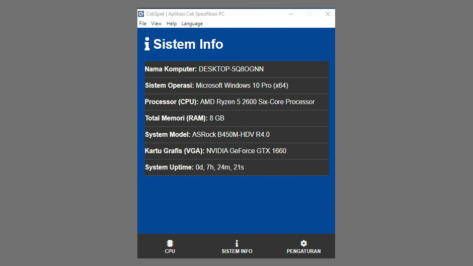

# 🖥️ CekSpek  

> **Aplikasi Desktop Cek Spesifikasi PC**

 

## Details
* **Size: 57 MB**  
* **Version: v1.1.1**  
* **Tanggal Rilis: 1 Februari 2021**  
* **Sistem Operasi (OS): Windows 10**
* **Developer: Iqbal Anggoro**  
* **Assets by Arya Nur Wiguna** 

[Download disini!](https://github.com/Baja-Softworks/CekSpek-Software/releases/download/v1.1.0/CekSpek---Aplikasi-Cek-Spesifikasi-PC-Setup-1.1.0.exe)

  

### Bantuan, Lapor Bug, dan Umpan Balik
**Twitter:** [@bajasoftworks](https://twitter.com/bajasoftworks) | **Instagram:** [@bajasoftworks](https://instagram.com/bajasoftworks)

### Support / Donasi
- [Trakteer](https://trakteer.id/bajasoftworks)

### Lisensi
MIT
<!-- [MIT](https://github.com/Baja-Softworks/CekSpek/blob/main/LICENSE.md) -->